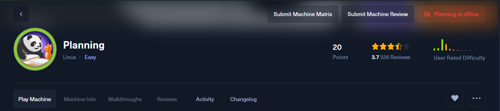

<h1 align="center">🧠 Hack The Box – Planning (Easy)</h1>

<p align="center">
  <a href="https://app.hackthebox.com/machines/Planning" target="_blank">
    
  </a>
</p>

<p align="center">
  <b><a href="https://app.hackthebox.com/machines/Planning">🔗 View Planning Machine on Hack The Box</a></b><br/>
  <i>By Vishnu S • Completed on July 6, 2025</i>
</p>

---

## 📄 Full Write-up

👉 [Click here to view the full walkthrough](./Planning.md)

---

## 🛠 Tools Used

- `nmap` – Port scanning  
- `ffuf` – Subdomain enumeration  
- `python3` – Exploit execution  
- `netcat` – Reverse shell listener  
- `ssh` – Remote login & port forwarding  
- `linPEAS` – Privilege escalation enumeration

---

## ✅ Techniques Used

- 🔍 Virtual host & subdomain enumeration  
- 🛠 Grafana Remote Code Execution (CVE-2024-9264)  
- 🐳 Docker container escape  
- 🔐 SSH credential reuse  
- 🚪 Port forwarding  
- 🧠 Reverse shell injection via internal panel

---

## 📸 Screenshot Previews

<p align="center">
  
  
  
</p>

---

## 🏁 Result

Captured both flags:

```bash
cat /home/enzo/user.txt
cat /root/root.txt
````

---

## 📚 References

* [HTB – Planning Machine](https://app.hackthebox.com/machines/Planning)
* [Grafana CVE-2024-9264](https://cve.mitre.org/cgi-bin/cvename.cgi?name=CVE-2024-9264)
* [Exploit by z3k0sec](https://github.com/z3k0sec/CVE-2024-9264-RCE-Exploit)
* [HackTricks](https://book.hacktricks.xyz/)


