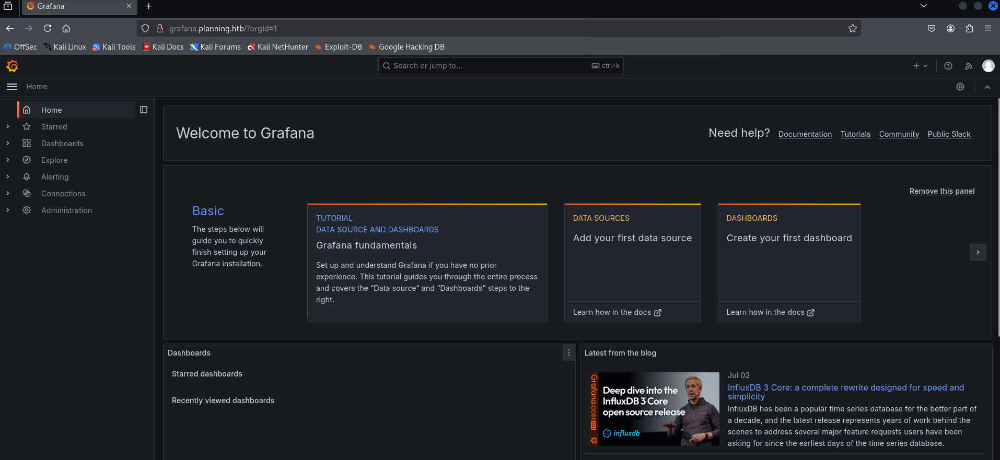

<h1 align="center">🧠 Hack The Box – Planning (Easy)</h1>

  

  <b>A full walkthrough of the Hack The Box 'Planning' machine</b> 
  <i>By Vishnu S | Completed on July 6, 2025</i>

---

## 📄 Write-up

🔗 [Click here to view the full write-up](./Planning_HTB.md)

---

## 🔍 What’s Inside

- ✅ Nmap enumeration
- ✅ Virtual host & subdomain discovery
- ✅ Grafana RCE exploitation (CVE-2024-9264)
- ✅ Docker escape using leaked credentials
- ✅ SSH port forwarding
- ✅ Reverse shell injection to gain root
- ✅ Screenshot-rich step-by-step explanation

---

## 📸 Preview Screenshots

  
  
  

---

## 🔗 References

- [Grafana RCE – CVE-2024-9264](https://cve.mitre.org/cgi-bin/cvename.cgi?name=CVE-2024-9264)
- [Exploit Script](https://github.com/z3k0sec/CVE-2024-9264-RCE-Exploit)
- [HackTricks](https://book.hacktricks.xyz/)

